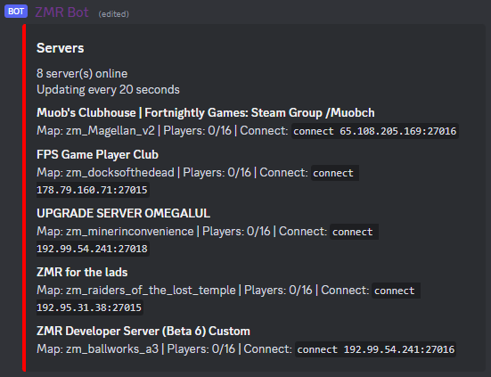

# SSDB - Source engine Server list Discord Bot
Creates a list of Source engine game servers and updates it regularly. Useful for small mod communities.

The list can be configured to display specific set of servers or all mod's servers. The list format can be customized.



## Running with Docker

```bash
cp .ssdb_config.ini.template .ssdb_config.ini

#
# Configure .ssdb_config.ini file with at least the bot token, channel id and the list method.
#

# Builds image and runs SSDB.
docker compose up
```

## Running manually

```bash
# Install dependencies
pip install -r requirements.txt

cp .ssdb_config.ini.template .ssdb_config.ini

#
# Configure .ssdb_config.ini file with at least the bot token, channel id, lower format setting and the list method.
#

# Run SSDB.
python ssdb.py
```
